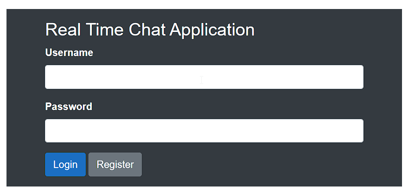
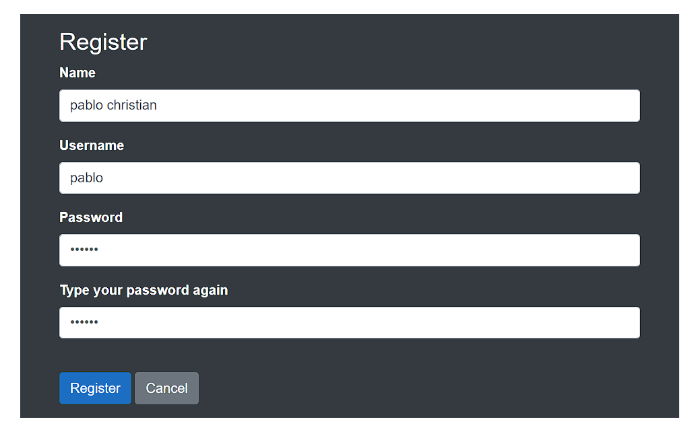
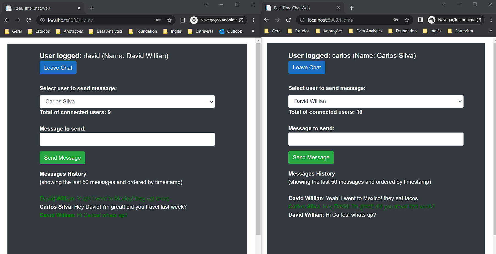
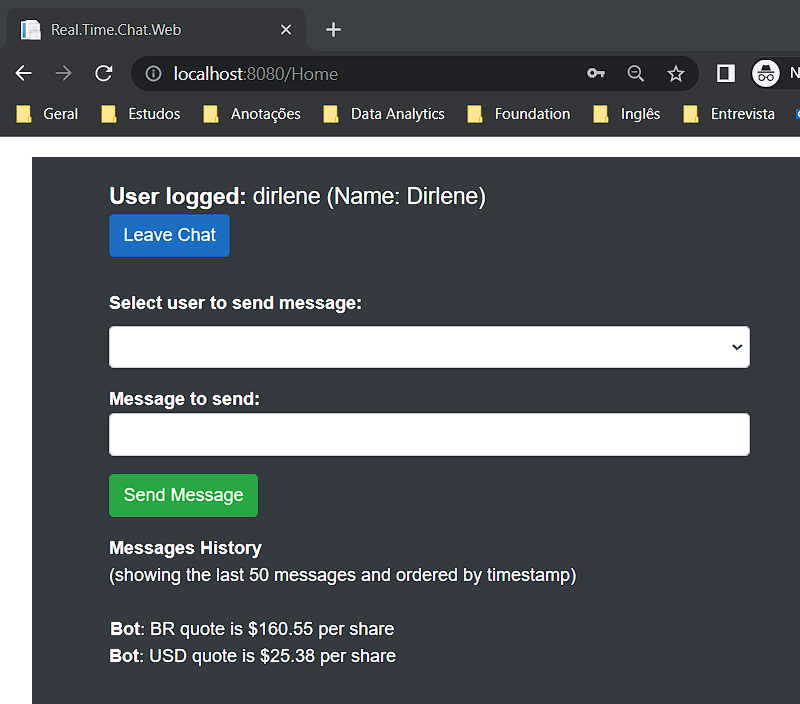
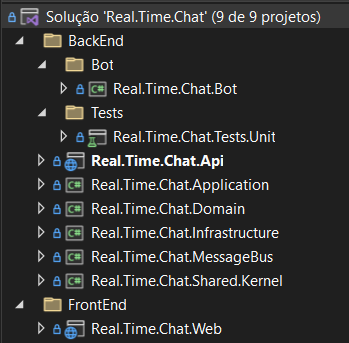
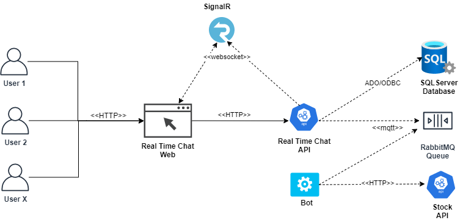

<h1 align="center">
⭐ Real Time Chat ⭐ 
</h1>
💬 A real time chat application using C# dotnet, SignalR, RabbitMQ, Identity and some other technologies and patterns. This is a coding challenge 👨‍💻

## Code Challenge

##### Assignment
📌 The goal of this exercise is to create a simple browser-based chat application using .NET.
This application should allow several users to talk in a chatroom and also to get stock quotes from an API using a specific command.

##### Mandatory Features
<ul>
	<li>✔ Allow registered users to log in and talk with other users in a chatroom.</li>
	<li>✔ Allow users to post messages as commands into the chatroom with the following format /stock=stock_code</li>
	<li>✔ Create a decoupled bot that will call an API using the stock_code as a parameter
(https://stooq.com/q/l/?s=aapl.us&f=sd2t2ohlcv&h&e=csv, here aapl.us is the
stock_code).</li>
	<li>✔ The bot should parse the received CSV file and then it should send a message back
	into the chatroom using a message broker like RabbitMQ. The message will be a stock quote
using the following format: “APPL.US quote is $93.42 per share”. The post owner will be
the bot.</li>
	<li>✔ Have the chat messages ordered by their timestamps and show only the last 50
messages.</li>
	<li>✔ Unit test the functionality you prefer.</li>
</ul>

##### Bonus (optional)
<ul>
	<li>✔ Have more than one chatroom.</li>
	<li>✔ Use .NET identity for users authentication.</li>
	<li>✔ Handle messages that are not understood or any exceptions raised within the bot.</li>
	<li>⚠️ Build an installer. <b>=> I used docker-compose to build and run the application, i'm not sure if that counts</b></li>
</ul>

##### Considerations
<ul>
	<li>✔ We will open 2 browser windows and log in with 2 different users to test the
functionalities.</li>
	<li>✔ The stock command won’t be saved on the database as a post.</li>
	<li>✔ The project is totally focused on the backend; please have the frontend as simple as you
can.</li>
	<li>✔ Keep confidential information secure.</li>
	<li>✔ Pay attention if your chat is consuming too many resources.</li>
	<li>✔ Keep your code versioned with Git locally.</li>
	<li>✔ Feel free to use small helper libraries.</li>
</ul>

## Demonstrations
Images showing how the application works:

##### Login Page

##### Register Page

##### Two different users logged and chatting

##### Stock Command

## Technologies and Patterns
🛠 These are all the technologies and patterns used to develop this application
##### BackEnd
- [C# .NET 6.0 Web API](https://dotnet.microsoft.com/en-us/download/dotnet/6.0)
- [AspNetCore SignalR 6.0](https://www.nuget.org/packages/Microsoft.AspNetCore.SignalR)
- [AspNetCore Identity 6.0](https://www.nuget.org/packages/Microsoft.AspNetCore.Identity)
- [RabbitMQ](https://www.nuget.org/packages/MassTransit.RabbitMQ/)
- [MediatR](https://www.nuget.org/packages/MediatR)
- [FluentValidation](https://www.nuget.org/packages/FluentValidation)
- [AutoMapper](https://www.nuget.org/packages/AutoMapper)
- [MassTransit](https://www.nuget.org/packages/MassTransit/8.0.6-develop.537)
- [Refit](https://www.nuget.org/packages/Refit)
- [Polly](https://www.nuget.org/packages/Polly)
- [Xunit](https://www.nuget.org/packages/xunit)
- [FluentAssertions](https://www.nuget.org/packages/FluentAssertions)
- [Moq](https://www.nuget.org/packages/Moq)

Patterns and Techniques:
- TDD (Test Driven Development)
- DDD (Domain Driven Design)
- CQRS (Command Query Responsibility Segregation)
- Middlewares: Error, Request and Response
- Dependency Injection
- Repository Pattern
- Unit of Work Pattern
- Domain Notification
- Domain Message

##### FrontEnd
- [C# .NET 6.0 Web](https://dotnet.microsoft.com/en-us/download/dotnet/6.0)
- [AspNetCore Identity Client 6.0](https://www.nuget.org/packages/Microsoft.AspNetCore.SignalR.Client/7.0.0-preview.6.22330.3)
- [Blazor](https://docs.microsoft.com/pt-br/aspnet/core/blazor/?view=aspnetcore-6.0)
- [CSS](https://www.w3schools.com/css/)
- [Bootstrap](https://getbootstrap.com/)
- [Javascript](https://developer.mozilla.org/pt-BR/docs/Web/JavaScript)

## Architecture
The project solution was based on DDD (Domain Driven Design) concept.

Below is the workflow diagram of the solution used:

**Explaining:** The users connect to the web application, which will interact to the web API. A channel will be opened with the client using SignalR, and the Web API will use SQLServer as database. A decoupled bot worker was created to communicate with the Stock API, and send messages to the rabbitMQ queue.

## Requirements
I recommend following the option 01, so you wont need to install and run all the other tools needed for the project to work.

**Option 01: Run in Containers** 
To run the local application in containers, you will need to download and install the following:
- [Docker Desktop](https://docs.docker.com/desktop/#download-and-install)
- [Docker Compose](https://docs.docker.com/compose/install/compose-desktop/)

**Option 02: Outside Containers** 
If you want to run the project outside containers, you must also have the following:
- [.NET 6.0](https://dotnet.microsoft.com/en-us/download/dotnet/6.0)
- [SQLServer](https://www.microsoft.com/pt-br/sql-server/sql-server-downloads)
- [RabbitMq](https://www.rabbitmq.com/download.html)

## Executing the Project
To execute the project, follow the steps below:

#### Important Notes
1. When executing the page for two or more users, you need to open the browser as incognito mode, because the token session is stored on local storage of your browser.
2. If for any reason you receive error sending message to RabbitMQ, it is because the port couldnt be opened or is in use. To solve the problem go on docker-compose on 'rabbitmq-service', change port number and run the commands again.

**Option 01: Run in Containers**
1. Run Docker Desktop.
2. Open the command prompt (cmd), navigate inside the project "\src" folder, and type: "docker-compose build" to build the containers (this is only necessary the first time).
3. Type "docker-compose up -d" to start the application containers.
4. Now you can view the application:
	1. To run the Web Application, navigate to http://localhost:8080
	2. To view the Web Api Swagger documentation, navigate to http://localhost:8082/swagger

to stop the execution of the containers, type "docker-compose down"

**Option 02: Outside Containers**
1. Run SQLServer(port 1435) and RabbitMQ (port 15673).
2. Open the command prompt (cmd), navigate inside the project "\src" folder, and type: "run.bat"
3. This script will run the projects and open the browsers.
